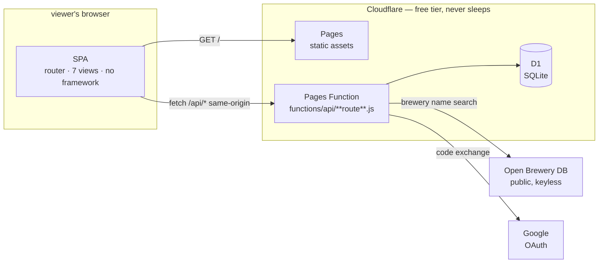
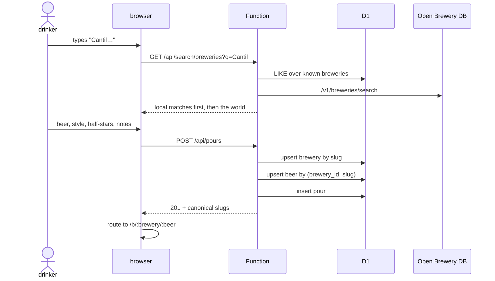
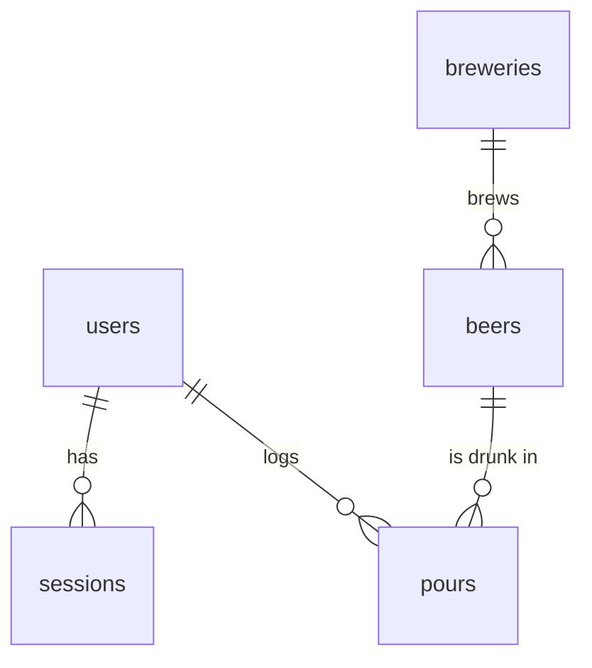

# Draught — design

The one sentence that constrains everything: **a pour is the unit of record, and
beers are canonical.** Two people who drink the same beer must land on the same
page, or the product is just a private diary.

## HLD — system context

Everything is same-origin. The page and the API share a host, which buys three
things at once: no CORS preflights, an `HttpOnly; SameSite=Lax` session cookie
the client-side JS cannot read, and no token to leak from `localStorage`.

**Why Cloudflare over the obvious alternative.** Supabase would supply auth
with less code, but its free tier pauses a project after about a week of
inactivity — fatal for a slow launch. D1 and Pages Functions never sleep, share
the account that already hosts Matinée's worker, and OAuth removes the need for
any email infrastructure.

**Trust boundaries.** The Function is the only thing that touches D1 and the
only holder of the OAuth secrets and `SESSION_SECRET`. Open Brewery DB sees a
brewery search string with no user identity attached. The providers see an OAuth
handshake. Nobody sees an email address, because Draught never asks for one.

**Failure posture.** Open Brewery DB is wrapped in a 3-second timeout and a
`try`; when it is slow or down, local brewery matches still appear and free text
always works. No dependency can block a pour from being logged.

## HLD — the one flow that matters

**The join that makes it Letterboxd and not a diary** is `slugify`: names are
lowercased, accent-folded (`Bière` → `biere`), and non-alphanumerics collapse to
single hyphens. `Cloudwater`, `cloudwater ` and `CLOUDWATER` are one brewery, so
the second person to log Small DIPA lands on the first person's page. This rule
is tested, because getting it wrong silently shards the whole database.

The first drinker to supply an ABV fills it in for everyone; later pours never
overwrite it.

## LLD — the schema

| Table | Key facts |
| --- | --- |
| `users` | `id` uuid, `handle` unique and nullable until claimed, `UNIQUE(provider, provider_id)`. No email column by design. |
| `sessions` | `id` is the **SHA-256 of `token + SESSION_SECRET`**, never the token. 90-day expiry checked on every read. |
| `breweries` | `slug` unique — the dedup key. Optional `obdb_id` when matched to Open Brewery DB. |
| `beers` | `UNIQUE(brewery_id, slug)` — a beer is canonical *within* a brewery. |
| `pours` | `rating` is `1..10` (half-stars, Letterboxd-style) or `NULL` for logged-but-unrated. `drunk_on` is the drinker's local date, not a timestamp. |

Ratings are stored doubled so the whole system stays in integers; `outOfFive()`
is the only place halving happens.

| Table | Key facts |
| --- | --- |
| `follows` | `PRIMARY KEY (follower_id, followee_id)` makes a double-follow a no-op; index on `followee_id` because "who follows me" is as hot as "who do I follow". |
| `lists` | `UNIQUE (user_id, slug)`. A repeated title takes `-2`, `-3`… rather than erroring — naming two lists the same thing is a mistake, not a conflict. |
| `list_items` | `PRIMARY KEY (list_id, beer_id)` so a beer can't appear twice; `position` drives ranked display. |
| photos | `pours.photo_key` is the drinker's shot; `beers.photo_key` is the one representing the beer. First upload wins the role, guarded by `WHERE photo_key IS NULL` so concurrent first-pours can't race. |

**Deleting a pour is the subtle one.** If its photo is also the beer's
representative shot, dropping the R2 object would leave a broken image on a page
that isn't the deleter's. So the role is handed to another drinker's photo first,
and the object is only binned once no pour *and* no beer points at it.

**Photos never reach R2 unprocessed.** The client draws them onto a canvas at
1400 px max edge and re-encodes as JPEG. That halves storage *and* strips EXIF —
GPS included. Server-side we still check the declared type against the file's
magic numbers, because a client is never the boundary.

## LLD — the API

One catch-all, `functions/api/[[route]].js`, dispatching on a path array.

| Route | Auth | Notes |
| --- | --- | --- |
| `GET /api/me` | cookie | returns `needsHandle` so the client can route to `/welcome` |
| `GET /api/auth/google` | — | sets a 10-minute state nonce cookie, redirects to Google |
| `GET /api/auth/:provider/callback` | state cookie | constant-time state compare, code exchange, session |
| `GET /api/auth/dev` | `DEV_LOGIN=1` | local-only; 404 otherwise |
| `POST /api/logout` | cookie | deletes the session row and clears the cookie |
| `POST /api/handle` | cookie | validates `^[a-z0-9_]{2,20}$`, rejects a reserved list |
| `PATCH /api/profile` | cookie | display name and bio |
| `GET /api/search/breweries` | — | local D1 matches, then Open Brewery DB, deduped by slug |
| `GET /api/search/beers` | — | typeahead over everything already logged |
| `POST /api/pours` | cookie + handle | the write path above |
| `DELETE /api/pours/:id` | cookie | scoped `WHERE id = ? AND user_id = ?`, so it cannot delete someone else's |
| `GET /api/users/:handle` | — | public shelf: stats, style histogram, ledger |
| `GET /api/beers/:brewery/:beer` | — | public beer page: aggregate, rating histogram, notes |
| `GET /api/recent` | — | last 40 pours, ordered by `drunk_on` (the field actually displayed) |

**Auth details worth keeping.** The OAuth `state` nonce is compared in constant
time. `upsertUser` refreshes the display name and avatar on every sign-in but
never touches a claimed handle. Validation caps every string server-side —
client limits are a convenience, not the boundary.

## LLD — the client

| File | Responsibility |
| --- | --- |
| `app.js` | history routing, the seven views, boot |
| `api.js` | same-origin fetch wrapper; unwraps `{error}` into thrown `Error`s |
| `ui.js` | `esc`, half-star rendering, the pour row, the star rail, the typeahead |
| `styles.js` | the style canon: 117 styles × {family, origin, ABV band} |
| `style.css` | Matinée's palette, adapted |

**XSS posture.** Views build HTML strings and assign `innerHTML`, so every
interpolation of user-supplied text goes through `esc()` — notes, names,
handles, brewery and beer names. That is the entire defence and it is tested.

**The star rail** is ten 0.5em-wide clipped spans over a 1em glyph: odd indices
show a glyph's left half, even indices (`.rh`) shift it `-0.5em` to show the
right. Hover previews, click commits to a hidden input.

**The typeahead** debounces 220 ms and guards against out-of-order responses
with a sequence number, so a slow early request can never overwrite the results
of a later keystroke.

## The look

**Modelled on Letterboxd, deliberately.** That is the thing being asked for, and
two attempts at being distinctive — a warm amber-on-black theme, then a light
editorial one in EB Garamond — both read worse than the obvious answer.

Dark, cool, dense. `--bg #14181c`, panels `#2c3440`, text `#f4f7f9`, secondary
`#9ab`. System font stack, no webfont. Small radii, tight rows, uppercase
micro-labels for section headers and nothing else shouting.

**One accent: amber `#f0a83c`** (9.4:1 on the background), and it means *state* —
a rating, the page you are on, the primary action, a count. Nothing else is
coloured. Verified by walking every rendered text node across all routes.

### Say what things are

The bigger fix was language, not colour. The interface had invented a private
vocabulary: "the Bar" for everyone's activity, "your shelf" for your own diary,
plus "the ledger", "the margins", "the wall", "the locals", "the library". Every
one of those required the reader to learn a metaphor before they could navigate.

Now:

| Was | Is |
| --- | --- |
| Feed / Bar | **Following** / **Everyone** |
| Your shelf | your username |
| the ledger | **Diary** |
| the margins | **Reviews** |
| the wall | **Photos** |
| the locals | **Top venues** |
| the library | **Lists** |
| pours | **entries**, or just "beers logged" |

The nav also shed two items: Settings and Sign out moved onto the settings page,
reached by clicking your own name. Six items became five, and the five are words
anyone can read cold.

## Explicit non-goals

No badges, streaks or check-in mechanics. No ads. No email storage. No
scraping. No follower graph *yet* — the shared beer page is the social surface,
and it works with one drinker or a thousand.
