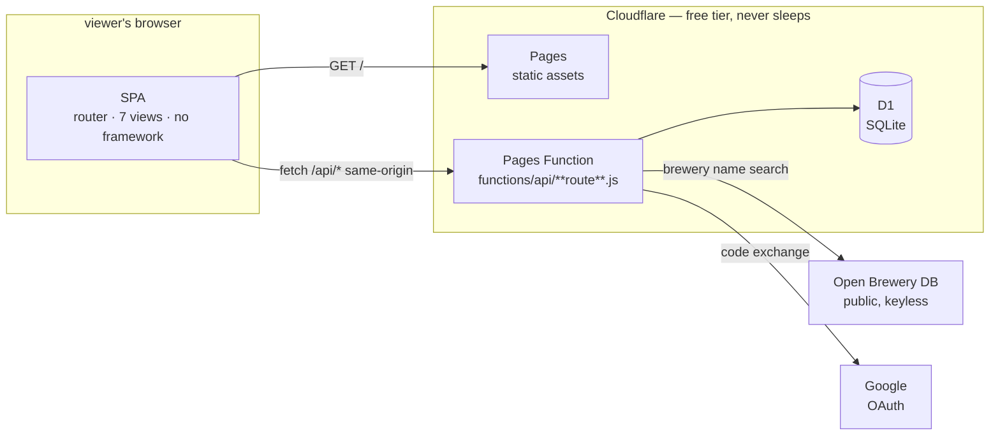
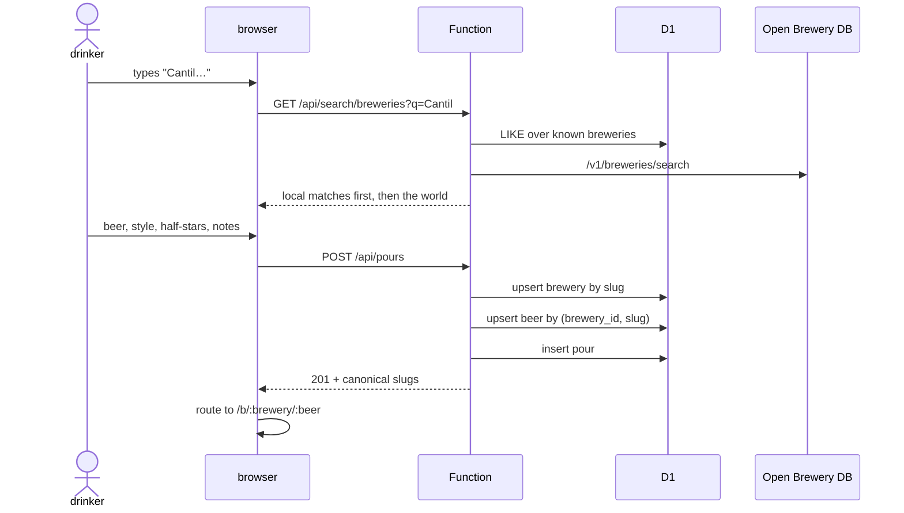
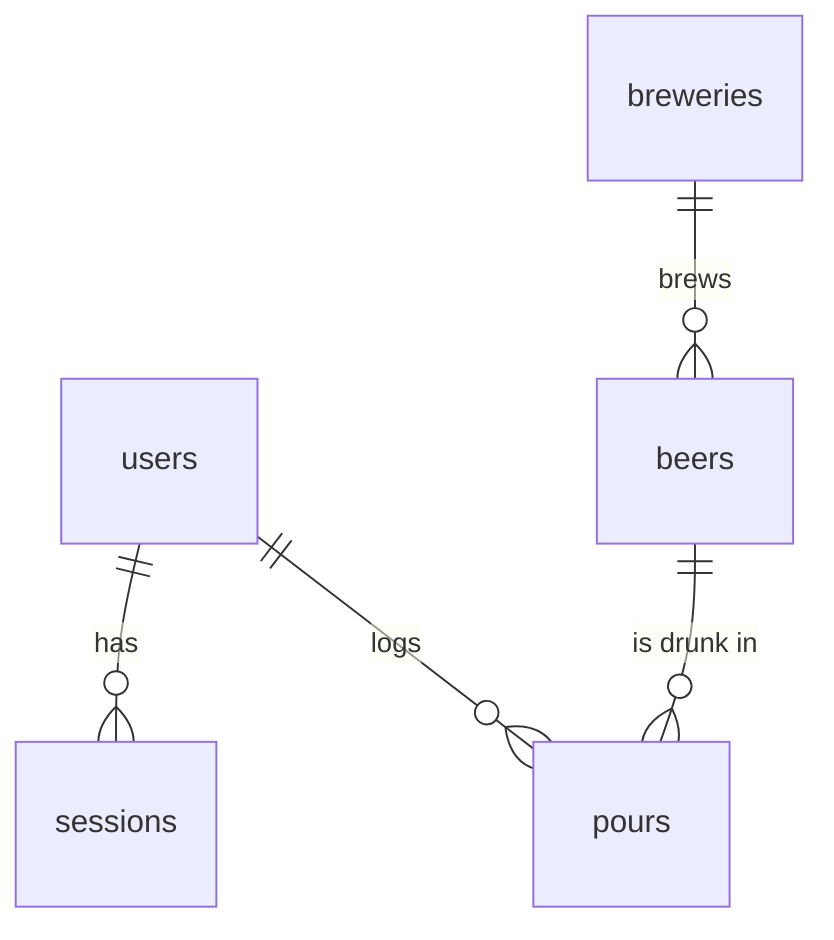

# Draught — design

The one sentence that constrains everything: **a pour is the unit of record, and
beers are canonical.** Two people who drink the same beer must land on the same
page, or the product is just a private diary.

## HLD — system context



Everything is same-origin. The page and the API share a host, which buys three
things at once: no CORS preflights, an `HttpOnly; SameSite=Lax` session cookie
the client-side JS cannot read, and no token to leak from `localStorage`.

**Why Cloudflare over the obvious alternative.** Supabase would supply auth
with less code, but its free tier pauses a project after about a week of
inactivity — fatal for a slow launch. D1 and Pages Functions never sleep, share
the account that already hosts Matinée's worker, and OAuth removes the need for
any email infrastructure.

**Trust boundaries.** The Function is the only thing that touches D1 and the
only holder of the OAuth secrets and `SESSION_SECRET`. Open Brewery DB sees a
brewery search string with no user identity attached. The providers see an OAuth
handshake. Nobody sees an email address, because Draught never asks for one.

**Failure posture.** Open Brewery DB is wrapped in a 3-second timeout and a
`try`; when it is slow or down, local brewery matches still appear and free text
always works. No dependency can block a pour from being logged.

## HLD — the one flow that matters



**The join that makes it Letterboxd and not a diary** is `slugify`: names are
lowercased, accent-folded (`Bière` → `biere`), and non-alphanumerics collapse to
single hyphens. `Cloudwater`, `cloudwater ` and `CLOUDWATER` are one brewery, so
the second person to log Small DIPA lands on the first person's page. This rule
is tested, because getting it wrong silently shards the whole database.

The first drinker to supply an ABV fills it in for everyone; later pours never
overwrite it.

## LLD — the schema



| Table | Key facts |
| --- | --- |
| `users` | `id` uuid, `handle` unique and nullable until claimed, `UNIQUE(provider, provider_id)`. No email column by design. |
| `sessions` | `id` is the **SHA-256 of `token + SESSION_SECRET`**, never the token. 90-day expiry checked on every read. |
| `breweries` | `slug` unique — the dedup key. Optional `obdb_id` when matched to Open Brewery DB. |
| `beers` | `UNIQUE(brewery_id, slug)` — a beer is canonical *within* a brewery. |
| `pours` | `rating` is `1..10` (half-stars, Letterboxd-style) or `NULL` for logged-but-unrated. `drunk_on` is the drinker's local date, not a timestamp. |

Ratings are stored doubled so the whole system stays in integers; `outOfFive()`
is the only place halving happens.

| Table | Key facts |
| --- | --- |
| `follows` | `PRIMARY KEY (follower_id, followee_id)` makes a double-follow a no-op; index on `followee_id` because "who follows me" is as hot as "who do I follow". |
| `lists` | `UNIQUE (user_id, slug)`. A repeated title takes `-2`, `-3`… rather than erroring — naming two lists the same thing is a mistake, not a conflict. |
| `list_items` | `PRIMARY KEY (list_id, beer_id)` so a beer can't appear twice; `position` drives ranked display. |
| photos | `pours.photo_key` is the drinker's shot; `beers.photo_key` is the one representing the beer. First upload wins the role, guarded by `WHERE photo_key IS NULL` so concurrent first-pours can't race. |

**Deleting a pour is the subtle one.** If its photo is also the beer's
representative shot, dropping the R2 object would leave a broken image on a page
that isn't the deleter's. So the role is handed to another drinker's photo first,
and the object is only binned once no pour *and* no beer points at it.

**Photos never reach R2 unprocessed.** The client draws them onto a canvas at
1400 px max edge and re-encodes as JPEG. That halves storage *and* strips EXIF —
GPS included. Server-side we still check the declared type against the file's
magic numbers, because a client is never the boundary.

## LLD — the API

One catch-all, `functions/api/[[route]].js`, dispatching on a path array.

| Route | Auth | Notes |
| --- | --- | --- |
| `GET /api/me` | cookie | returns `needsHandle` so the client can route to `/welcome` |
| `GET /api/auth/google` | — | sets a 10-minute state nonce cookie, redirects to Google |
| `GET /api/auth/:provider/callback` | state cookie | constant-time state compare, code exchange, session |
| `GET /api/auth/dev` | `DEV_LOGIN=1` | local-only; 404 otherwise |
| `POST /api/logout` | cookie | deletes the session row and clears the cookie |
| `POST /api/handle` | cookie | validates `^[a-z0-9_]{2,20}$`, rejects a reserved list |
| `PATCH /api/profile` | cookie | display name and bio |
| `GET /api/search/breweries` | — | local D1 matches, then Open Brewery DB, deduped by slug |
| `GET /api/search/beers` | — | typeahead over everything already logged |
| `POST /api/pours` | cookie + handle | the write path above |
| `DELETE /api/pours/:id` | cookie | scoped `WHERE id = ? AND user_id = ?`, so it cannot delete someone else's |
| `GET /api/users/:handle` | — | public shelf: stats, style histogram, ledger |
| `GET /api/beers/:brewery/:beer` | — | public beer page: aggregate, rating histogram, notes |
| `GET /api/recent` | — | last 40 pours, ordered by `drunk_on` (the field actually displayed) |

**Auth details worth keeping.** The OAuth `state` nonce is compared in constant
time. `upsertUser` refreshes the display name and avatar on every sign-in but
never touches a claimed handle. Validation caps every string server-side —
client limits are a convenience, not the boundary.

## LLD — the client

| File | Responsibility |
| --- | --- |
| `app.js` | history routing, the seven views, boot |
| `api.js` | same-origin fetch wrapper; unwraps `{error}` into thrown `Error`s |
| `ui.js` | `esc`, half-star rendering, the pour row, the star rail, the typeahead |
| `styles.js` | the style canon: 117 styles × {family, origin, ABV band} |
| `style.css` | Matinée's palette, adapted |

**XSS posture.** Views build HTML strings and assign `innerHTML`, so every
interpolation of user-supplied text goes through `esc()` — notes, names,
handles, brewery and beer names. That is the entire defence and it is tested.

**The star rail** is ten 0.5em-wide clipped spans over a 1em glyph: odd indices
show a glyph's left half, even indices (`.rh`) shift it `-0.5em` to show the
right. Hover previews, click commits to a hidden input.

**The typeahead** debounces 220 ms and guards against out-of-order responses
with a sequence number, so a slow early request can never overwrite the results
of a later keystroke.

## Design language

Inherited from Matinée, because a projector lamp and a pint are the same colour:
`--amber: #e6a648` on `--bg: #0e0c09`, mono uppercase letterspaced labels
against a heavy condensed display face, one accent and no second hue. The film
grain becomes condensation on a cold glass. No web fonts.

## LLD — rate limiting

Fixed-window counters in D1, one row per `action:actor` bucket. The whole check
is a single statement:

```sql
INSERT INTO rate_limits (bucket, window_start, count) VALUES (?1, ?2, 1)
ON CONFLICT(bucket) DO UPDATE SET
  window_start = CASE WHEN ?2 - rate_limits.window_start >= ?3 THEN ?2 ELSE rate_limits.window_start END,
  count        = CASE WHEN ?2 - rate_limits.window_start >= ?3 THEN 1 ELSE rate_limits.count + 1 END
RETURNING count, window_start
```

Read-then-write would race with itself and let bursts through; one UPSERT with
`RETURNING` is atomic. The actor is the signed-in user id, falling back to
`cf-connecting-ip` so anonymous endpoints are still bounded.

| Action | Cap | Why |
| --- | --- | --- |
| `newBeer` | 25/h | The vandalism vector — this mints rows everyone sees |
| `pour` | 40/h | Ordinary logging; deliberately looser than `newBeer` |
| `upload` | 30/h | Costs storage |
| `listItem` | 120/h | Cheap, curating is bursty |
| `followAct` | 100/h | Stops follow-spam without hampering a browsing session |
| `listCreate` | 15/h | |
| `handleClaim` | 10/h | Also blunts handle enumeration |
| `brewerySearch` | 300/h per IP | Politeness to Open Brewery DB's free API |

Two deliberate choices: the limiter **fails open** (a broken limiter must not
take logging down with it), and hitting the `newBeer` cap still lets you log
against beers that already exist — the cap gates *creation*, not use.

## LLD — deletion

`DELETE /api/account` is the only destructive endpoint, and it is ordered for
recoverability: collect the user's photo keys, run one **atomic batch** for every
delete, then perform idempotent fixups.

`beers.created_by` has no `ON DELETE` action, so a user who ever created a beer
cannot be deleted while it references them — the batch nulls it first. (D1 *does*
enforce foreign keys; assuming otherwise cost a debugging round.) The fixups hand
any beer cover the departing user supplied to a surviving drinker's photo, then
bin only genuinely unreferenced R2 objects. Canonical breweries and beers stay:
other people's pours point at them, and deleting a beer because one drinker left
would vandalise their shelves.

## LLD — the map

`worldmap.js` is Natural Earth 110m country outlines baked into equirectangular
SVG paths (viewBox 1000x403, Antarctica clipped), served from our own origin.
**No tile server and no map library** — a tile request would leak every viewer's
IP to a third party, and the privacy page promises that doesn't happen.

The projection was recovered from the path data rather than documented anywhere:
longitude spans the full width, giving `1000/360 = 2.7778 px/deg`, and the
vertical offset came from fitting the path bounding box (y 4..391) to Natural
Earth's land extremes — 83.6°N at Greenland, -55.9°S at Cape Horn — which puts
viewBox y=0 at **85.04°N**. Validated by projecting twelve known cities and
asserting each falls inside its own country's path via `isPointInFill`. Eleven
hit; Sydney lands 1px offshore, which is the 110m coastline's own coarseness
(1px = 0.36° ≈ 40km), not a projection error.

### Finding a place

`GET /api/places` proxies **Photon** (photon.komoot.io), an OSM-based geocoder
built for typeahead. Two alternatives were rejected: Nominatim, OSM's main
geocoder, *explicitly forbids* autocomplete in its usage policy; and Google
Places needs a billing account with a card on file and would put a third-party
script on every page, which the privacy page promises there isn't.

Proxying matters — Photon only ever sees this Worker, never a viewer's IP or
identity. Responses are cached for 24h on the normalised upstream URL, so the
same search costs Photon one request a day rather than one per keystroke (157ms
cold, 3ms warm), and the endpoint is rate limited because it is someone else's
free service. Results rank `amenity=pub|bar|brewery|…` above everything else,
because this is a beer app and not a gazetteer.

A picked suggestion stores its geography on the input's dataset; editing the name
by hand clears it, or a typed-in venue would silently inherit the last
suggestion's city and coordinates.

### The privacy line on location

Publishing "who drank where" is the feature. Publishing someone's home address
is not — and "where I drink most" is very often home. Four guards:

| Guard | Effect |
| --- | --- |
| Rounding | Coordinates are cut to 4 dp (~11m) *before* storage. Enough for a bar, not a flat. |
| Name check | Venues named `home`, `my flat`, `office`… are stored with **no coordinates at all**, whatever the device reported. Whole-name match, so "The Homestead" is unaffected. |
| `geo_private` | Any pour can be excluded from every public map query while still showing on its own shelf. |
| Explicit capture | The device is only asked on an explicit "Pin this spot" tap. No background tracking. |

Venues are canonical and shared, keyed by the same `slugify` as breweries, so
two people at the same bar produce one dot rather than one per spelling.

`venues.created_by` deliberately carries **no foreign key**: `beers.created_by`
has one with no `ON DELETE` action, which blocked account deletion outright until
it was nulled first. Once was enough.

## Explicit non-goals

No badges, streaks or check-in mechanics. No ads. No email storage. No
scraping. No follower graph *yet* — the shared beer page is the social surface,
and it works with one drinker or a thousand.
